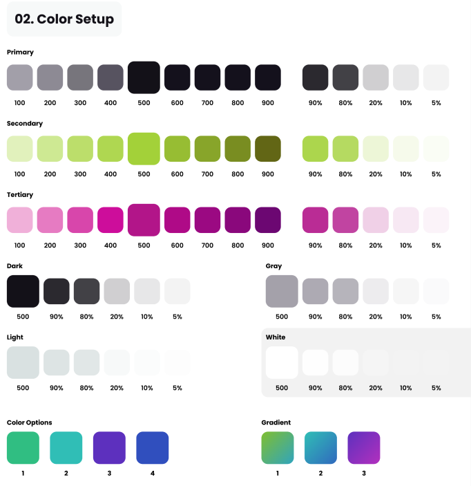

2. Color setup

Header da

linkler için text-primary-400 kullandım hover için text-primary-900
iconlar için text-primary-400 kullandım hover için text-primary-900

megamenu de

başlıklar için text-primary-900
linkler için text-primary-500 hover:text-gray-950

## Primary

- 100: #A3A3A3
- 200: #8E8E8E
- 300: #787878
- 400: #636363
- 500: #4E4E4E
- 600: #393939
- 700: #242424
- 800: #0F0F0F
- 900: #000000
- 90%: #292929
- 80%: #3D3D3D
- 20%: #CCCCCC
- 10%: #E5E5E5
- 5%: #F2F2F2

## Secondary

- 100: #E3F7BA
- 200: #D6F3A3
- 300: #C7F087
- 400: #BBED72
- 500: #A7E051
- 600: #8FC737
- 700: #74A828
- 800: #647B1D
- 900: #5B7121
- 90%: #A2DC63
- 80%: #C2EC95
- 20%: #F1F9DB
- 10%: #F7FDEB
- 5%: #FBFDF6

## Tertiary

- 100: #F3A4C3
- 200: #F28EB7
- 300: #F170A5
- 400: #F04C97
- 500: #EC1C84
- 600: #C31578
- 700: #940D68
- 800: #660859
- 900: #430344
- 90%: #F26893
- 80%: #F690A8
- 20%: #F9DEE5
- 10%: #FCF0F3
- 5%: #FEF7F9

## Dark

- 500: #000000
- 90%: #1A1A1A
- 80%: #333333
- 20%: #CCCCCC
- 10%: #E5E5E5
- 5%: #F2F2F2

## Gray

- 500: #8C8C8C
- 90%: #A0A0A0
- 80%: #B5B5B5
- 20%: #E5E5E5
- 10%: #F2F2F2
- 5%: #F7F7F7

## Light

- 500: #C6E6E7
- 90%: #D3EBEC
- 80%: #E0EFF0
- 20%: #F6FBFB
- 10%: #FBFDFD
- 5%: #FDFEFE

## White

- 500: #FFFFFF
- 90%: #FFFFFF
- 80%: #FFFFFF
- 20%: #FFFFFF
- 10%: #FFFFFF
- 5%: #FFFFFF

## Color Options

1. #00C99E
2. #00A4B8
3. #985CFF
4. #3B5FFF

## Gradient

1. Gradient: #56CCF2 to #2F80ED
2. Gradient: #6DD5FA to #3494E6
3. Gradient: #654EA3 to #EA5C54
